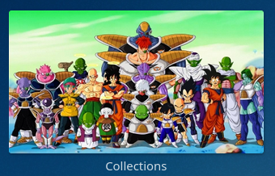

# Overview
The purpose of this library is to share (non-plugin) tools I use for managing my Jellyfin instance and/or media library.

Currently, the only functionality of this library is to generate images with Jellyfin-like styling (shadow overlay and 
library title text) from source images. 
This was created because Jellyfin's included functionality to use a custom image as a library cover doesn't run its own 
styling library on the custom image.

# Installation

Download

Install

# Tools
## `jellyfin-cover`
### The Problem
Here's what a Jellyfin-generated library image looks like.

Unfortunately, this image is randomly generated from the backdrops of the media in the library, so if we get one we 
don't like, we just just have to keep generating new ones until we get one that looks good.

---
Here's what a custom library image looks like when used as a custom library cover in Jellyfin:

There's no styling applied. 

### The Solution

Call the `jellyfin-cover` CLI in this package to apply styling to your image which will match Jellyfin's auto-generated 
styling. It will also resize the image for optimal use by Jellyfin in order to not take up any unnecessary storage on 
your server!

`jellyfin-cover --image /path/to/image.png --title Library`

You can also generate multiple at the same time: 

`jellyfin-cover --image /path/to/image/1.png /path/to/image/2.png --title Library1 Library2`

❗️Note that you'll need to include quotes for a library title which includes spaces, or else the CLI doesn't know how to
parse it correct. Example: 

`jellyfin-cover --image /path/to/image/1.png /path/to/image/2.png --title Movies "Home Movies"`

Much better!